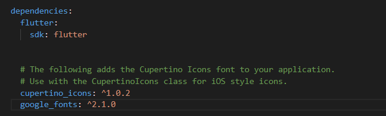

# Flutter learn

## Installation 

* Download zip file : "flutter_windows_x-stable.zip"
* SDK releases : https://flutter.dev/docs/development/tools/sdk/releases
* Extract .zip file in a location out of C:\Program Files\. This one needed privileges. (C:\src\flutter)
* Source code : C:\src > git clone https://github.com/flutter/flutter.git -b stable
* Environment variables > PATH=["C:\src\flutter\bin"]

To check binaries paths execute :
```
$ which flutter dart
```

To check needed components :
```
$ flutter doctor
```

To valid android licenses execute : 
```
$ flutter doctor -–android-licenses
```

To use android commands you have to install "Android SDK Command-line Tools" in SDK Manager [Android Studio](https://developer.android.com/studio) Android Studio/Settings/Appearence&Beahviours/AndroidSDK/SDKTools. If the command line is not installed an exception will occure ('java.lang.NoClassDefFoundError').

## Create project

Add git binaries in env. var. PATH

```
flutter create app_name
flutter devices #to show devices
flutter emulators #to discovers connected and emulated devices (AVD Manager)
flutter emulators --launch Pixel_2_API_27 #to launch an emulator
flutter run
```

## Tests

[Google Tutoriel](https://codelabs.developers.google.com/codelabs/flutter-app-testing/#0)

## Packages

Add packages in file 'pubspec.yaml' in depedencies section.



You can run command to download packages :

```
flutter pub get
```

### Errors

* Could not open settings generic class cache for settings file. Install Java 8. (Gradle 6.7 compatible Java 8 => 15) (Gradle 7.x compatible Java 8 => 16)


